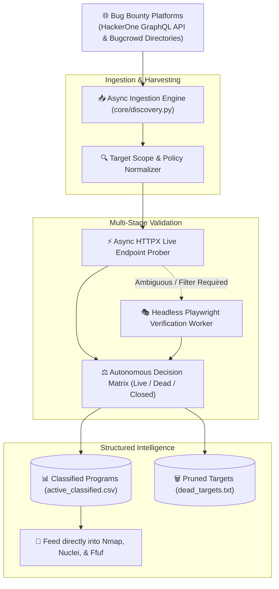

<div align="center">

# 🛰️ ReconScope: Bug Bounty Scope Intelligence Pipeline

### Autonomous Asset Discovery, Scope Classification & Multi-Threaded Validation Engine

[](https://www.python.org/)
[](https://playwright.dev/)
[](https://www.python-httpx.org/)
[](https://docs.pydantic.dev/)
[](https://github.com/Textualize/rich)
[](LICENSE)

**Scope Ingestion • Dead Target Pruning • Playwright UI Verification • Structured Asset Export**

[Pipeline Architecture](#-pipeline-architecture) • [Core Capabilities](#-core-capabilities) • [Installation & Usage](#-installation--quick-start) • [Exported Schemas](#-data-schemas--export-formats)

</div>

---

## 🎯 Overview

**ReconScope** (`private-recon-tools`) is an automated intelligence pipeline engineered for professional bug bounty hunters and red teams. 

Modern bug bounty platforms frequently list thousands of programs whose target scopes are defunct, deprecated, or ineligible for rewards. ReconScope eliminates hundreds of hours of manual validation by programmatically harvesting scope endpoints from **HackerOne** and **Bugcrowd**, verifying submission availability via headless browser telemetry, probing HTTP response dynamics asynchronously, and categorizing targets into structured actionable datasets.

---

## 🏗 Pipeline Architecture



---

## 🌟 Core Capabilities

- ⚡ **High-Concurrency Scope Probing:** Utilizes asynchronous HTTPX client pools to validate hundreds of target endpoints simultaneously with strict timeout and connection pooling controls.
- 🎭 **Playwright Headless Verification:** Bypasses client-side rendering hurdles on submission forms, detecting closed signals ("program not live", archived forms, or missing submission dropdowns).
- 🏷️ **Intelligent Program Classification:**
  - `active` – Live, open for reports, and responsive.
  - `dead` – DNS nxdomain, persistent connection timeouts, or decommissioned submission forms.
  - `bounty_eligible` – Segregates cash-reward engagements from points-only programs.
- 📊 **Rich Terminal Dashboard:** Interactive live progress bars, status summaries, and real-time statistics powered by the `Rich` Python library.
- 💾 **Clean Artifact Generation:** Generates machine-readable CSV outputs and filtered URL lists formatted for direct chaining with recon suites (`ffuf`, `subfinder`, `nuclei`).

---

## 💻 Installation & Quick Start

### 1. Prerequisites
- **Python 3.10+**
- Chromium browser binaries for Playwright

### 2. Environment Setup
```bash
# Clone the repository
git clone https://github.com/3bkader-gpt/private-recon-tools.git
cd private-recon-tools

# Set up virtual environment
python -m venv .venv

# On Linux/macOS:
source .venv/bin/activate
# On Windows:
.venv\Scripts\activate

# Install dependencies
pip install -r requirements.txt

# Install Playwright browser
playwright install chromium
```

### 3. Usage Examples

```bash
# Run full reconnaissance and classification pipeline
python main.py

# Filter and classify HackerOne targets specifically
python filter_hackerone_dead.py --input hackerone_urls.txt --output hackerone_classified.csv

# Classify Bugcrowd programs
python h1_classify.py --platform bugcrowd --input bugcrowd_urls.txt
```

---

## 📊 Data Schemas & Export Formats

The classification engine produces standardized CSV schemas:

```csv
url,platform,status,reason_code,reason,response_pct,bounty_eligible
https://hackerone.com/example/embedded_submissions/new,hackerone,active,verified_live,Target validated live,100%,True
https://hackerone.com/old-app/embedded_submissions/new,hackerone,dead,closed_signal,Closed signal detected: 'program not live',0%,False
```

---

## 📄 License

This tool is open-source under the [MIT License](LICENSE).
